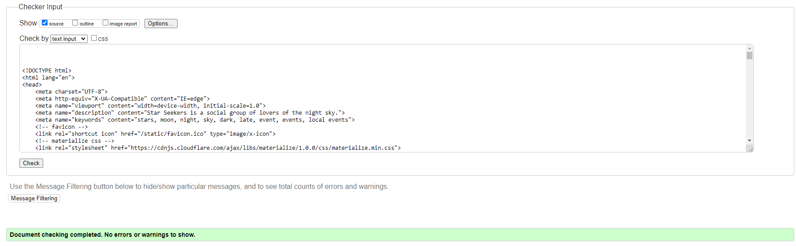

# Star Seekers Testing

## Automated Testing

### HTML validation:  
All of the HTML written for this website was validated using [this HTML validator](https://validator.w3.org/).  

#### Home Page:  
  

#### Events Page:  
  

#### Event Details Page:  
  

#### Event Form Page:  
  

### CSS validation: 
All of the CSS written for this website was validated using [this CSS validator](https://jigsaw.w3.org/css-validator/).  

#### style.css:  
  

### JavaScript validation:  
All of the JS written for this website passes through [JSHint](https://jshint.com/) without raising any errors/warnings.  

### Python validation:  
All of the custom python written for this website through [this PEP8 linter](https://pep8ci.herokuapp.com/) without raising any errors.  

#### admin.py:  
  

#### forms.py:  
  

#### models.py:  
  

#### urls.py:  
  

#### views.py:  
  

#### test_forms.py:  
  

#### test_models.py:  
  

#### test_views.py:  
  

### Django Unit Testing:  
In addition to the manual testing documented below, the functionality of forms.py, models.py, and views.py was tested using Django Testing Tools for this project.

For additional information on the tests written, please see the following test files:  
- [test_forms.py](/events/test_forms.py)
- [test_models.py](/events/test_models.py)  
- [test_views.py](/events/test_views.py)  

The results for these tests can be seen below:  
  
Unfortunately, as seen above, 2 tests fail. These 2 tests test the post functionality of the add_event view and the edit_event view and attempt to submit a valid form and assert that the page redirects. For some reason however, no redirect happens for either test. I would love to have resolved this issue but I have spent over 3 days working on this problem and have made no progress in resolving it. Here is what I have tried:  
- Firstly, I ensured that the actual testing code was written correctly, and having combed through it multiple times, I am very confident that I have not made any errors with syntax/spelling/logic.
- Second, I am confident that I am attempting to test a POST request correctly because the same testing file contains a seperate test that checks if the question form redirects after a successful post request, that test passes with no errors and is structured almost identically to these tests.
- Thirdly, one of the solutions proposed online was that the page would not redirect if the data submitted was invalid. To check this I moved the post example data into a variable called form and asserted that form.is_valid, this test passed meaning there is no validation errors with the data I am attempting to post in the tests.

Having tried all of the above without success, I am unsure what else could possibly be causing the problem. It may not be relevant but during the production of this project I was required to migrate the project workspace from GitPod to CodeAnywhere. This process wasn't entirely smooth and has raised some other small errors since the migration, however these were easy to deal with. I fail to see how this could really impact these tests in particular but I feel it is worth mentioning.

As a final word about this issue, I would like to stress that whilst the tests fail, I have tested this functionality using the same data as the test files from the website's front-end and the forms do indeed submit and redirect. I wanted to keep the tests to prove that I have created them and so I could be honest about the difficulties I faced whilst tackling the automated testing for this project. I hope that this explanation makes up for the unfortunate fails.

Additionally, [coverage](https://coverage.readthedocs.io/en/latest/) was used to view what percentage of python code was covered by my tests:  
  
The slight dip in percentage for the views.py and test_views.py files is linked to the issue mentioned above. Coverage doesn't seem to recognise that the lines relevant to the failed tests are tested at all.

### Lighthouse results:  
Google DevTools provides a service called Lighthouse report. The results of this report for each page can be seen below:  

Home Page:  
  

Events Page:  
  

Event Details Page:  
  

Event Form Page:  
  

Just to note, the accessibilty scores for the event details and event form pages is slightly lower because Lighthouse doesn't seem to recognise that the dropdown form elements on both of these pages include labels. My code does include labels for the select inputs however based on the reports advice, it looks like materialize applies some automatic styling to dropdown form elements and that is what is causing this slight drop in score. As I am not able to refactor the materialize code, I cannot improve these scores. 

## Manual Testing

### User Stories  
To show how the features of this website meet the requirements of the user stories, I have created this chart that demostrates which features are relevant to each user story:  

| User Story | Achieved | Relevant Features |
|------------|----------|-------------------|
| US01 - Create Account | YES | F05 - Register Account Form |
| US02 - Positive First Impression | YES | F01 - Header, F02 - Footer, F03 - Home Page |
| US03 - Logging In | YES | F04 - Log In Form |
| US04 - Logging Out | YES | F06 - Log Out Form |
| US05 - View Events | YES | F07 - Upcoming Events |
| US06 - View Event Details | YES | F08 - Event Details |
| US07 - Additional Event Info | YES | F08 - Event Details |
| US08 - View Event Guide | YES | F08 - Event Details |
| US09 - Book Event | YES | F09 - Booking Form |
| US10 - Asking Questions | YES | F10 - Ask a Question Form, F11 - Previously Asked Questions |
| US11 - Booking Confirmation | YES | F09 - Booking Form |
| US12 - Add Events | YES | F12 - Add Event Form |
| US13 - Update Events | YES | F13 - Edit Event Form |
| US14 - Delete Events | YES | F14 - Deleting an Event |
| US15 - Add Guides | YES | F15 - Admin Panel - Guides |
| US16 - Update Guides | YES | F15 - Admin Panel - Guides |
| US17 - Delete Guides | YES | F15 - Admin Panel - Guides |
| US18 - Answer User Questions | YES | F16 - Admin Panel - Answers |

### Functionality  
| Test Label | Test Action | Expected Outcome | Test Outcome |
|------------|-------------|------------------|--------------|
| Internal links | Click links in the header from various pages. | The links should redirect to the correct locations. | PASS |
| External links | Click social links in the footer. | The links should redirect the user to the correct social site in a new tab. | PASS |
| Creating an event | Add a new event as an admin from the front-end. | The add button should redirect to the event form page, the form should only submit upon receiving valid data, the submitted event should be created and visible from the events page. | PASS |
| Editing an existing event | Edit an already existing event from the front-end. | The edit button should redirect to the event form page, the form should be pre-filled with the event data, the changes should be saved and visible from the event details page. | PASS |
| Event Deletion | Delete an event from the front-end. | The delete button should produce the relevant confirmation modal, pressing delete event should permanently delete the event. | PASS |
| Booking a spot at an event | Use the booking form as a user. | The form should only accept valid data, upon a successful submission a confirmation modal should appear and the user should receive a confirmation email. | PASS |
| Asking a Question | Attempt to submit a question as a user. | The question form should accept valid data and successfully asked questions should appear in the previously asked question section. | PASS |
| Answering a Question | Attempt to answer a question as an admin. | The admin panel should let admins answer questions and the answer should appear alongside the question on the relevant event details page. | PASS |

### Browser Compatibility  
This website fully function on the following web browsers:  
- Google Chrome
- Microsoft Edge
- Mozilla Firefox

## Bugs

### Known Bugs:  
Apart from the previously mentioned testing error, this project currently suffers from 1 bug. This bug is related to the custom error handlers I created to replace the django defaults. For some reason, depsite having the same code structure in urls.py and views.py, the 404 error handler works correctly but 403 errors still use the django default template. Both me and my mentor are confused as to why this is. Having both looked at all the relevant code, we don't believe it is an issue caused by any syntax errors of mine. I have looked at various examples of how others have created and configured custom error handlers and referenced the Django docs multiple times to try various solutions but nothing seems to work. The only potential cause proposed by my mentor was to do with differences in Django versions. When I first created this project, I installed the latest version of Django (4.2 at the time) but I changed this to the LTS version (3.2) shortly after creating the events app. Brian and I looked through the django release notes for the newer versions but couldn't find anything that referenced custom error handlers. Other than this, I am unsure what else could be causing this issue or how to fix it.  

### Solved Bugs:  
- When the event form was first created, It would not successfully submit even with valid data. After some research on the Code Institute slack channel, I discovered that I needed to add the following attribute to the form element: `enctype="multipart/form-data"`. After making this addition, the form began submitting correctly.
- When first created, attempting to trigger a 404 error would return a 500 error instead. By analysing the error messages in my workspace terminal, I discovered that I had made a syntax error when adding a link to the home page in the 404 template. The href of the link was not created correctly and so attempting to reach the page returned an internal server error instead. I fixed this bug by correcting the syntax.  

Return to [README](README.md)